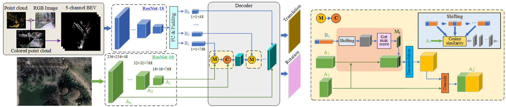
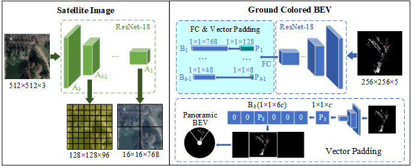
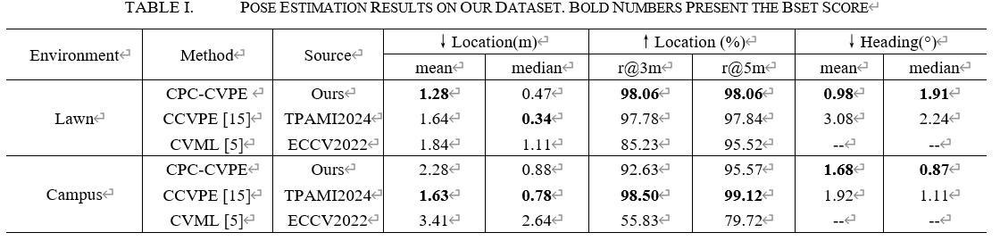
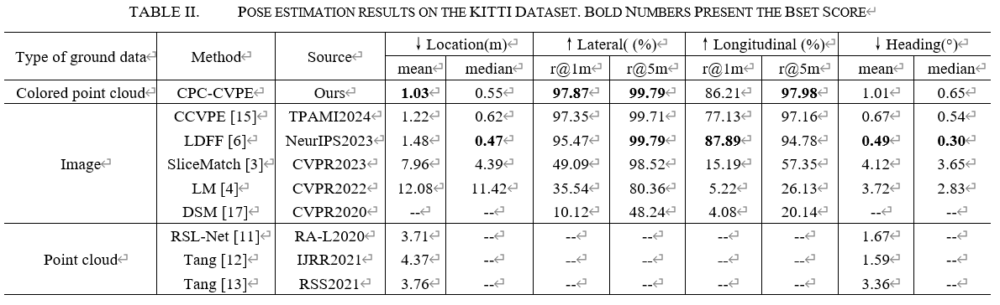
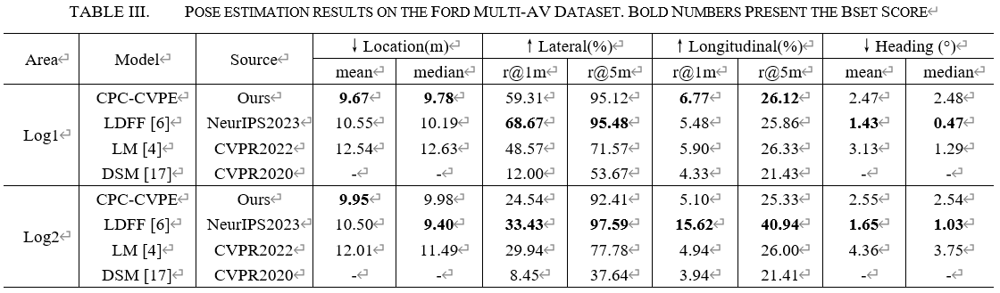

# CPC_CVPE
here's the framework of paper named "Let's Look Down from the Air: Matching of Colored Point Cloud  and Satellite Image for Cross-View Pose Estimation"

the ration modual is as follow

# Abstract
This paper proposes a Colored Point Cloud based Cross-View Pose Estimation network (CPC-CVPE).    We produce data with smaller differences to make efficient and accurate ground to air cross-view 3-degrees-of-freedom pose estimation.    Firstly, the 3D colored point cloud is obtained by calibrating LiDAR and camera, and projected into a low resolution 5-channel bird's-eye view (BEV).    Then, we use a lightweight backbone to extract deep features from both BEV and satellite images.    The output feature map of BEV is resized by fully connected layer to k feature vectors with different length, and they are matched with different scales of satellite image feature maps to estimate localization and heading.    A vector padding and shifting based matching strategy are designed in the cross-view matching module to get high-precision pose estimation results.     We collect and annotate a dense colored point cloud and satellite image cross-view pose estimation dataset.    Extensive experiments are conducted on our dataset, KITTI, and Ford Multi-AV, and CPC-CVPE gets competitive result compare with the state-of-the-art methods.

### Experiment Dataset
We use three  dataset to do the experiments:
- self-made datset: this dataset will be avilable soon!
- KITTI dataset: please refer to https://github.com/shiyujiao/HighlyAccurate to download the dataset.
- Ford multi-AV: please refer to https://github.com/shiyujiao/HighlyAccurate to download the dataset.
### Codes
will be updated soon!

### Experiment Results
here is the expriment results in three dataset

